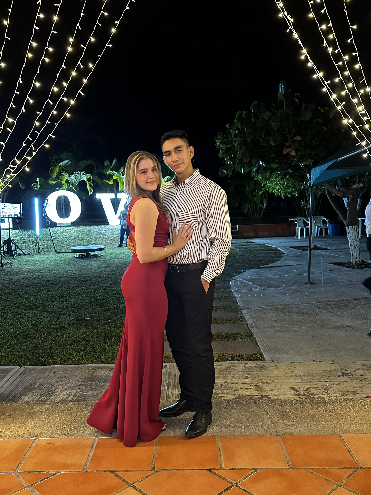
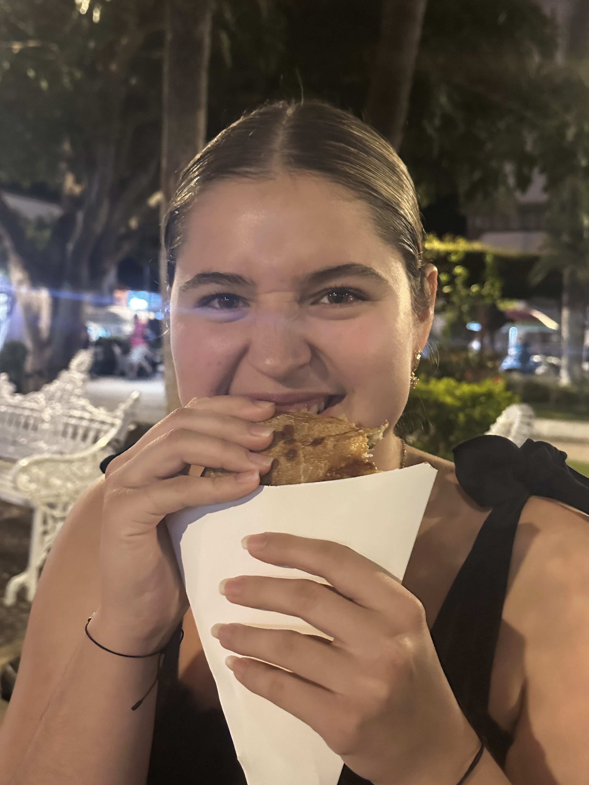
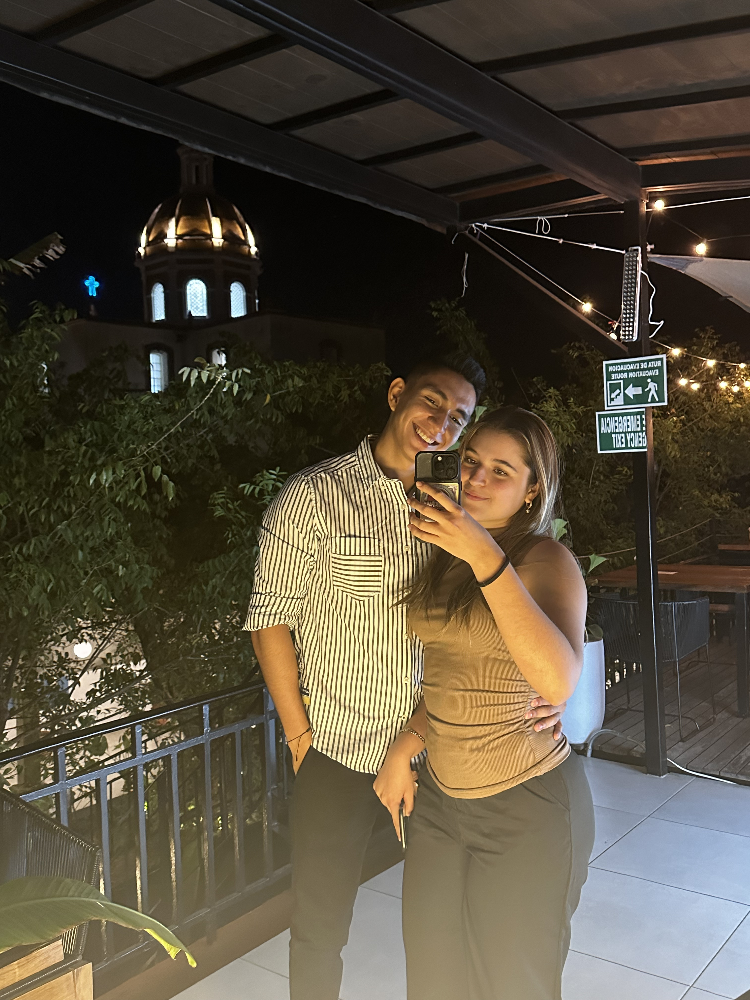
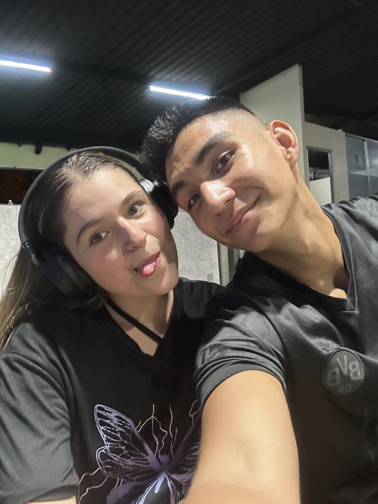
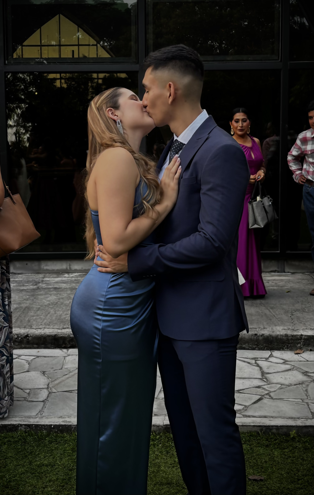
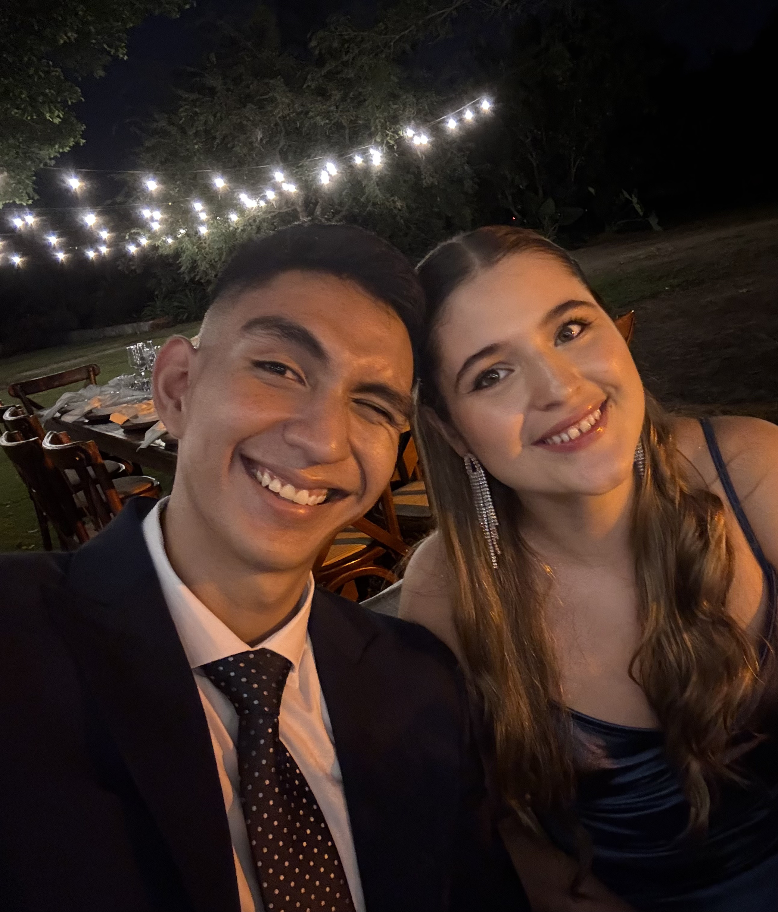
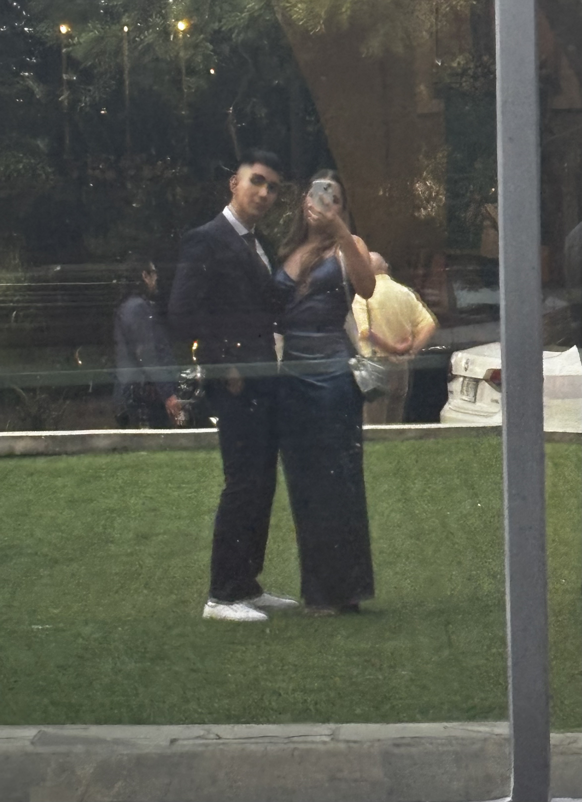
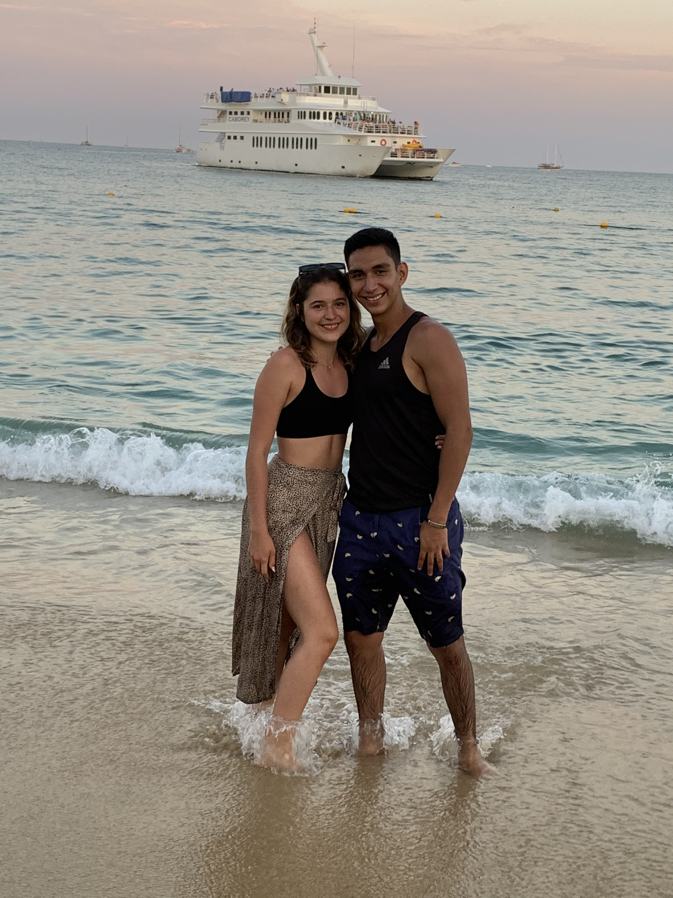

<!DOCTYPE html>
<html lang="es">
<head>
    <meta charset="UTF-8">
    <meta name="viewport" content="width=device-width, initial-scale=1.0">
    <title>Para ti ❤️</title>
    <link rel="stylesheet" href="NavStyle.css">
    <link href="https://fonts.googleapis.com/css2?family=Dancing+Script:wght@700&family=Quicksand:wght@400;600&family=Indie+Flower&display=swap" rel="stylesheet">
</head>
<body>

    <audio id="audio-principal" loop><source src="cancion1.mp3" type="audio/mpeg"></audio>
    <audio id="audio-stories" loop><source src="cancion2.mp3" type="audio/mpeg"></audio>
    <audio id="audio-carta" loop><source src="cancion3.mp3" type="audio/mpeg"></audio>

    

    

        <button class="menu-toggle" onclick="toggleMenu()">❤️ Menú</button>
        

            <button onclick="cambiarSeccion('principal')">Inicio 🏠</button>
            <button onclick="cambiarSeccion('stories')">Stories 📸</button>
            <button onclick="cambiarSeccion('carta')">Carta 📜</button>
        

    

    <section id="sec-principal" class="seccion activa">
        

            <h1 class="titulo-principal">Recap 2025</h1>
            
Por más momentos a tu lado

            
Desde el 29 de marzo de 2022

        

        

            
            
            
            
            
            
            
            
            
            
             
             
             
             
             
             
             
             
        

    </section>

    <section id="sec-stories" class="seccion">
        

            
❤️

            
✨

            
❤️

            
✨

            
❤️

        

        

            
<h2> Gracias por: </h2>

            

                
                

                    
Samy_Carlos.2912

                    
                    

❤️ 💬 ✈️

Me acompañas a todas lados

                

                

                    
Samy_Carlos.2912

                    
                    

❤️ 💬 ✈️

Tus sonrisas que me alegran la vida

                

                

                    
Samy_Carlos.2912

                    
                    

❤️ 💬 ✈️

Compatir momentos juntos

                

                

                    
Samy_Carlos.2912

                    
                    

❤️ 💬 ✈️

Entrenar en las buenas y malas

                

                

                    
Samy_Carlos.2912

                    
                    

❤️ 💬 ✈️

Ser parte de mi vida y mi familia

                

                

                    
Samy_Carlos.2912

                    
                    

❤️ 💬 ✈️

Cambiarme como tu maniqui

                

                

                    
Samy_Carlos.2912

                    
                    

❤️ 💬 ✈️

Por acompañarme a los viajes

                

                

                    
Samy_Carlos.2912

                    
                    

❤️ 💬 ✈️

Comvertirte en más que mi novia, sino en mi vida

                

                

                    
Samy_Carlos.2912

                    
                    

❤️ 💬 ✈️

Seguirme en mis ideas locas

                

                

                    
Samy_Carlos.2912

                    
                    

❤️ 💬 ✈️

Por pedirme y empezar la historia

                

                

                    
Samy_Carlos.2912

                    
                    

❤️ 💬 ✈️

Ser parte especial en todo

                

                

                    
Samy_Carlos.2912

                    
                    

❤️ 💬 ✈️

Darme la oportunidad de ser tu familia

                

                

                    
Samy_Carlos.2912

                    
                    

❤️ 💬 ✈️

Los bellos momentos que compartimos

                

                

                    
Samy_Carlos.2912

                    
                    

❤️ 💬 ✈️

Los detalles que tienes conmigo

                

                

                    
Samy_Carlos.2912

                    
                    

❤️ 💬 ✈️

Ir a todos lados conmigo

                

                

                    
Samy_Carlos.2912

                    
                    

❤️ 💬 ✈️

Por un 2026 mejor.

                

                
                

            

        

    </section>
    <section id="sec-carta" class="seccion">
        

        

            

                
❤️

                <h2 class="saludo-carta">Hola mi vida</h2>
                

                    

                        Muchas gracias por este año lleno de aventuras, risas
                        y bellos momentos que compartimos juntos, de verdad
                        no tengo palabras para demostrarte lo tan importante
                        que eres para mi. 
                    

                    

                        Quizas no soy el mejor haciendo detalles o manualidades,
                        pero te prometo dar todo lo mejor de mi para cumplir con
                        la persona que te mereces y más.
                
                    

                    

                        De verdad, gracias por todo y espero tener un 2026 mucho
                        mejor. 
                    

                

                
Firma tu ingeniero,  Carlitos ❤️

            

        

    </section>
    
</body>
</html>
